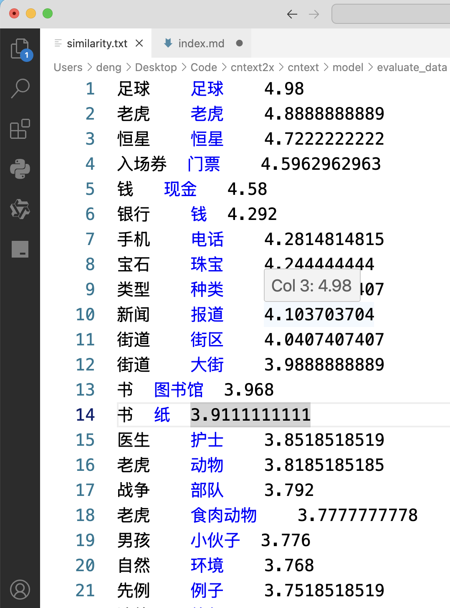
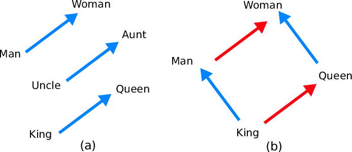
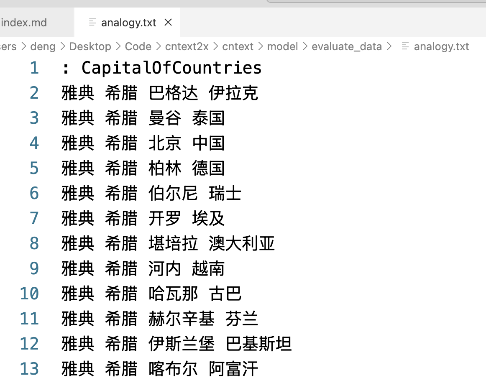

中文语料预训练模型列表， 使用 cntext2.x 训练出的预训练语言模型， 主要分 GloVe 和 Word2Vec 两种。

<br>

## 一、中文预训练模型

使用 [cntext2.x](https://cntext.readthedocs.io/zh-cn/latest/intro.html) 训练得到的中文预训练模型资源，汇总如下

对中文语料进行了近义测试和类比测试， 其中斯皮尔曼秩系数(Spearman's Rank Coeficient) 取值[-1,1], 取值越大表示模型越符合人类的认知。

类比测试有首都国家（CapitalOfCountries）、省会省份（CityInProvince）、家人关系（FamilyRelationship）、社会科学(管理、经济、心理等 SocialScience) 的类别准确率测试。

<br>

| 数据集                                                                                              | 词向量                                                                                                                    | 网盘                                                      | 斯皮尔曼秩系数 | 首都国家(%) | 省会省份(%) | 家人关系(%) | 社会科学(%) |
| --------------------------------------------------------------------------------------------------- | ------------------------------------------------------------------------------------------------------------------------- | --------------------------------------------------------- | -------------- | ----------- | ----------- | ----------- | ----------- |
| [中国政府工作报告](https://textdata.cn/blog/2023-12-17-gov-anual-report-dataset/)                   | **_人民政府(国省市)工作报告-GloVe.200.15.bin_**                                                                           | https://pan.baidu.com/s/1IdK8RU9L8mp6I2nhcoSmyA?pwd=ht2s  | 0.38           | 30.73       | 98.86       | 0.00        | 0.00        |
| [中国政府工作报告](https://textdata.cn/blog/2023-12-17-gov-anual-report-dataset/)                   | **_人民政府(国省市)工作报告-Word2Vec.200.15.bin_**                                                                        | https://pan.baidu.com/s/1GoTjMbUcYS4jN6w4GqlqBA?pwd=qb5b  | 0.35           | 30.06       | 96.00       | 0.00        | 16.67       |
| [中国裁判文书网](https://textdata.cn/blog/2023-05-07-china-law-judgment-documents-datasets/)        | **_裁判文书-GloVe.200.15.bin_**                                                                                           | https://pan.baidu.com/s/1a0Fisvnkl8UaQZrHP7olCQ?pwd=8w49  | 0.37           | 7.69        | 98.86       | 75.53       | 25.00       |
| [留言板](https://textdata.cn/blog/2023-12-22-renmin-gov-leader-comment-board/)                      | **_留言板-Word2Vec.200.15.bin_**                                                                                          | https://pan.baidu.com/s/1n7vwCOBnrye1CYrt_IBqZA?pwd=9m42  | 0.45           | 19.33       | 100         | 61.40       | 20        |
| [留言板](https://textdata.cn/blog/2023-12-22-renmin-gov-leader-comment-board/)                      | **_留言板-GloVe.200.15.bin_**                                                                                          | https://pan.baidu.com/s/1e5Y5enOaSUsBdkpg8byWbw?pwd=8zg7   |  0.38           | 12.61       | 100         | 65.81      | 25.00        |
| [A 股年报](https://textdata.cn/blog/2023-03-23-china-a-share-market-dataset-mda-from-01-to-21/)     | **_mda01-23-GloVe.200.15.bin_**                                                                                           | https://pan.baidu.com/s/1vXvbomHjOaFBeEz7GV0R6A?pwd=y6hd  | 0.34           | 78.13       | 100         | 0           | 37.50       |
| [A 股年报](https://textdata.cn/blog/2023-03-23-china-a-share-market-dataset-mda-from-01-to-21/)     | **_mda01-23-Word2Vec.200.15.bin_**                                                                                        | https://pan.baidu.com/s/11V1RyqH_cKE9eju0Mm-1TQ?pwd=kcwx  | 0.41           | 27.27       | 97.14       | 10          | 44.44       |
| [港股年报](https://textdata.cn/blog/2024-01-21-hk-stock-market-anual-report/)                       | **_英文港股年报-Word2Vec.200.15.bin_**                                                                                    | https://pan.baidu.com/s/1ISGAoZnA_1Ben6M2DCliOQ?pwd=nagx  | ---            | ---         | ---         | ---         | ---         |
| [港股年报](https://textdata.cn/blog/2024-01-21-hk-stock-market-anual-report/)                       | **_中文港股年报-Word2Vec.200.15.bin_**                                                                                    | hhttps://pan.baidu.com/s/1smMcrPtIP8g635YABCodig?pwd=sjdj | 0.35           | 25.20       | 79.43       | 18.59       | 25          |
| [人民日报](https://textdata.cn/blog/2023-12-14-daily-news-dataset/)                                 | [年份 Word2Vec](https://textdata.cn/blog/2023-12-28-visualize-the-culture-change-using-people-daily-dataset/)             | https://pan.baidu.com/s/1Ru_wxu9egsmhM7lATjSlgQ?pwd=bcea  |                |             |             |             |             |
| [人民日报](https://textdata.cn/blog/2023-12-14-daily-news-dataset/)                                 | [对齐模型 Aligned_Word2Vec](https://textdata.cn/blog/2023-12-28-visualize-the-culture-change-using-people-daily-dataset/) | https://pan.baidu.com/s/1IVgP0MyQpez0hpoJyEyFdA?pwd=7qsu  |                |             |             |             |             |
| [专利申请](https://textdata.cn/blog/2023-04-13-3571w-patent-dataset-in-china-mainland/)             | **_专利摘要-Word2Vec.200.15.bin_**                                                                                        | https://pan.baidu.com/s/1FHI_J7wU9eQGRckD12QB5g?pwd=6rr2  | 0.46           | 3.78        | 25.14       | 33.33       | 37.50       |
| [专利申请](https://textdata.cn/blog/2023-11-20-word2vec-by-year-by-province/)                       | **_province_w2vs 分省份训练词向量_**                                                                                      | https://pan.baidu.com/s/1eBFTIZcv2DWssLiaRnCqZQ?pwd=ikpu  |                |             |             |             |             |
| [专利申请](https://textdata.cn/blog/2023-11-20-word2vec-by-year-by-province/)                       | **_year_w2vs 分年份训练词向量_**                                                                                          | https://pan.baidu.com/s/1lrVkML92cVJdHQa1HQyAwA?pwd=4gqa  |                |             |             |             |             |
| 大众点评评论语料                                                                                    | **_大众点评-评论-Word2Vec.200.15.bin_**                                                                                   | https://pan.baidu.com/s/15He728XGzoXDFYrUWDTaqQ?pwd=eg6x  | 0.34           | 50.31       | 89.71       | 70.00       | 0.00        |
| 大众点评评论语料                                                                                    | **_大众点评-评论-GloVe.200.15.bin_**                                                                                   | https://pan.baidu.com/s/1cKyv0-CuMqnuM2ENElF6rw?pwd=2b44  | 0.36          | 55.83        | 86.29|94.29 |0.00|
| 中文歌词                                                                                            | **_中文歌词-Word2Vec.200.15.bin_**                                                                                        | https://pan.baidu.com/s/1h1g1mOACmpCwn5pz8jR3vQ?pwd=ub2z  | 0.06           | 0.00        | 0.00        | 0.9         | 0.00        |
| 英文歌词                                                                                            | **_英文歌词-Word2Vec.200.15.bin_**                                                                                        | https://pan.baidu.com/s/1ycy-BTSa8zqW_xbIoshy6Q?pwd=hu1v  |                |             |             |             |             |
| [黑猫消费者投诉](https://textdata.cn/blog/2025-03-05-consumer-complaint-dataset/)                   | **_消费者黑猫投诉-Word2Vec.200.15.bin_**                                                                                  | https://pan.baidu.com/s/1FOI2BIVRojOswdKfqaNbsw?pwd=catc  | 0.32           | 16.18       | 68          | 28.57       | 0.00        |
| [豆瓣影评](https://textdata.cn/blog/2024-04-16-douban-movie-1000w-ratings-comments-dataset)         | **_douban-movie-1000w-Word2Vec.200.15.bin_**                                                                              | https://pan.baidu.com/s/1uq6Ti7HbEWyT4CgktKrMng?pwd=63jg  | 0.43           | 39.02       | 28.57       | 92.65       | 25.00       |
| [B 站](https://textdata.cn/blog/2023-11-12-using-100m-bilibili-user-sign-data-to-training-word2vec) | **_B 站签名-Word2Vec.200.15.bin_**                                                                                        | https://pan.baidu.com/s/1OtBU9BzitcNxkmPzhzH6FQ?pwd=m3iv  | 0.34           | 25.56       | 33.71       | 44.17       | 0.00        |
| [B 站弹幕](https://github.com/Viscount/IUI-Paper)                                                   | **_B 站弹幕-Word2Vec.200.15.bin_**                                                                                        | https://pan.baidu.com/s/1LNDLed5uP3KnUMmrKf_uhg?pwd=x4t8  | 0.42           | 11.67       | 65.81       | 44.17       | 25.00       |

<br><br>

## 二、cntext2.x

cntext2.x 是中英文文本分析库，内置有多重词典和常用函数。 常见的文本分析代码行数在数十行，而 cntext2.x 力求将代码量控制在 2~5 行。

### 2.1 训练模型

训练模型步骤:

1. 构建语料
2. 训练模型

```python
import cntext as ct

# 大邓Mac 96G内存， 12核使用的代码。
w2v = ct.Word2Vec(corpus_file='留言板.txt',
                  vector_size=200,
                  window_size=15,
                  lang='chinese',
                  chunksize=100000,
                  min_count=5)
```

Run

```
Mac(Linux) System, Enable Parallel Processing
Cache output/renmin_board_cache.txt Not Found or Empty, Preprocessing Corpus
Reading Preprocessed Corpus from output/renmin_board_cache.txt
Start Training Word2Vec
Word2Vec Training Cost 2692 s.
Output Saved To: output/留言板-Word2Vec.200.15.bin
```

<br>

cntext2.x 训练模型的教程可参考

- [使用 1 亿 B 站用户签名训练 word2vec 词向量](https://textdata.cn/blog/2023-11-12-using-100m-bilibili-user-sign-data-to-training-word2vec/)
- [使用 1985 年-2025 年专利申请摘要训练 Word2Vec 模型](https://textdata.cn/blog/2023-11-10-training-word2vec-model-using-china-3751w-patent-application-dataset/)
- [使用 MD&A2001-2023 语料训练 Word2Vec/GloVe 模型](https://textdata.cn/blog/2023-03-24-load-w2v-and-expand-your-concpet-dicitonary/)
- [使用裁判文书语料训练 GloVe 词向量](https://textdata.cn/blog/2025-04-17-training-a-glove-model-using-china-judgements-corpus/)
- [使用 5000w 专利申请数据集按年份(按省份)训练词向量](https://textdata.cn/blog/2023-11-20-word2vec-by-year-by-province/)
- [使用人民网领导留言板语料训练 Word2Vec 模型](https://textdata.cn/blog/2023-12-28-train-word2vec-using-renmin-gov-leader-board-dataset/)

<br>

### 2.2 评估模型

使用近义法和类比法， 判断模型的表现。详情可查看[文档](https://cntext.readthedocs.io/zh-cn/latest/model.html)

**近义测试**

cntext2.x 内置 537 条近义实验数据， 可直接使用。



```python
ct.evaluate_similarity(w2v)
```

Run

```
近义测试: similarity.txt
/Library/Frameworks/Python.framework/Versions/3.12/lib/python3.12/site-packages/cntext/model/evaluate_data/similarity.txt

评估结果：
+----------+------------+----------------------------+
| 发现词语 | 未发现词语 | Spearman's Rank Coeficient |
+----------+------------+----------------------------+
|   426    |    111     |            0.45            |
+----------+------------+----------------------------+
```

Spearman’s Rank Coeficient 系数取值[-1, 1], 取值越大， 说明模型表现越好。

<br>

**类比测试**

- 雅典之于希腊，似如巴格达之于伊拉克。
- 哈尔滨之于黑龙江，似如长沙之于湖南。
- 国王之于王后，似如男人之于女人。



cntext2.x 内置 1194 条类比， 格式如下



```python
ct.evaluate_analogy(wv)
```

Run

```
类比测试: analogy.txt
/Library/Frameworks/Python.framework/Versions/3.12/lib/python3.12/site-packages/cntext/model/evaluate_data/analogy.txt
Processing Analogy Test: 100%|██████████████| 1198/1198 [00:11<00:00, 99.91it/s]

评估结果：
+--------------------+----------+------------+------------+----------+
|      Category      | 发现词语 | 未发现词语 | 准确率 (%) | 平均排名 |
+--------------------+----------+------------+------------+----------+
| CapitalOfCountries |   238    |    439     |   19.33    |   2.74   |
|   CityInProvince   |   175    |     0      |   100.00   |   1.01   |
| FamilyRelationship |   272    |     0      |   61.40    |   1.96   |
|   SocialScience    |    10    |     60     |   20.00    |   1.50   |
+--------------------+----------+------------+------------+----------+
```

- CapitalOfCountries 留言板语料在此项表现较差， 应该是语料中常见国家首度的提及较少。
- CityInProvince 留言板语料在此项表现如此优异，应该是语料中省份、省会地域词经常出现。
- FamilyRelationship 留言板中应该少不了家长里短， 所以此项准确率还可以。 以[年报 MD&A](https://textdata.cn/blog/2023-03-24-load-w2v-and-expand-your-concpet-dicitonary/)为例，此处准确率只有 10%, 而[豆瓣影评](https://textdata.cn/blog/2024-04-16-douban-movie-1000w-ratings-comments-dataset/)该处准确率高达 92.65%。
- SocialScience 留言板语料在此项表现一般， 应该是语料中常见的社会科学词语提及较少。

整体而言，语料训练的效果很不错，抓住了数据场景的独特性语义。

<br><br>

## 三、模型使用

### 3.1 读取模型

```python
import cntext ct

w2v = ct.load_w2v('output/留言板-Word2Vec.200.15.bin')
print('维度数:', w2v.vector_size)
print('词汇量: ', len(w2v))
w2v
```

Run

```
Loading output/留言板-Word2Vec.200.15.bin...
维度数: 200
词汇量:  1050245
<gensim.models.keyedvectors.KeyedVectors at 0x328d737a0>
```

<br>

### 3.2 KeyedVectors 的操作方法(或属性)

| 方法                                                  | 描述                                |
| ----------------------------------------------------- | ----------------------------------- |
| **_KeyedVectors.index_to_key_**                       | 获取词汇表中的所有单词。            |
| **_KeyedVectors.key_to_index_**                       | 获取单词到索引的映射。              |
| **_KeyedVectors.vector_size_**                        | 获取 GloVe 模型中任意词向量的维度。 |
| **_KeyedVectors.get_vector(word)_**                   | 获取给定单词的词向量。              |
| **_KeyedVectors.similar_by_word(word, topn=10)_**     | 获取某词语最相似的 10 个近义词。    |
| **_KeyedVectors.similar_by_vector(vector, topn=10)_** | 获取词向量最相似的 10 个近义词。    |
| ...                                                   | ...                                 |

<br>

### 3.3 查看词表

因为词表有 **_1050245_** 个词， 为了方便，这里只显示前 20 个词

```
# 词表带顺序的
list(w2v.index_to_key)[:20]
```

Run

```
['问题',
 '进行',
 '您好',
 '工作',
 '小区',
 '反映',
 '领导',
 '情况',
 '相关',
 '留言',
 '没有',
 '感谢您',
 '网友',
 '业主',
 '办理',
 '公司',
 '建设',
 '回复',
 '支持',
 '部门']
```

<br>

查看词表映射

```
w2v.key_to_index
```

Run

```
{'问题': 0,
 '进行': 1,
 '您好': 2,
 '工作': 3,
 '小区': 4,
 '反映': 5,
 '领导': 6,
 ...
  '连续': 995,
 '稳定': 996,
 '市住建局': 997,
 '降低': 998,
 '会同': 999,
 ...}
```

<br>

### 3.4 获取某词的向量

查找某词对应的词向量

```python
# w2v['问题']
w2v.get_vector('问题')
```

Run

```
array([-6.2813835 ,  1.5916584 , -0.48086444, -2.6446412 , 10.031776  ,
       -0.11915778, -5.039283  , -2.1107564 ,  1.1351422 , -2.881387  ,
        4.2890835 , -1.1337206 ,  3.7850847 , -3.640467  , -0.96282107,
        ...
        ...
        1.1314462 , -2.5386178 , -2.3993561 , -2.0407596 ,  0.95457   ,
        3.03732   , -2.033116  , -0.20390491,  3.5368073 ,  6.5452943 ,
        2.1186016 ,  0.79572505,  2.5855987 ,  0.88565165, -1.812104  ],
      dtype=float32)
```

受限于篇幅，这里显示词向量的部分数值。

<br>

需要注意，如果查询的词不存在于模型词表，则会出现报错。例如

```
word = '这是一个不存在的词'
w2v.get_vector(word)
```

Run

```
---------------------------------------------------------------------------
KeyError                                  Traceback (most recent call last)
Cell In[130], line 2
      1 word = '这是一个不存在的词'
----> 2 w2v.wv.get_vector(word)

File /Library/Frameworks/Python.framework/Versions/3.11/lib/python3.11/site-packages/gensim/models/keyedvectors.py:446, in KeyedVectors.get_vector(self, key, norm)
    422 def get_vector(self, key, norm=False):
    423     """Get the key's vector, as a 1D numpy array.
    424
    425     Parameters
   (...)
    444
    445     """
--> 446     index = self.get_index(key)
    447     if norm:
    448         self.fill_norms()

File /Library/Frameworks/Python.framework/Versions/3.11/lib/python3.11/site-packages/gensim/models/keyedvectors.py:420, in KeyedVectors.get_index(self, key, default)
    418     return default
    419 else:
--> 420     raise KeyError(f"Key '{key}' not present")

KeyError: "Key '这是一个不存在的词' not present"

```

<br>

### 3.5 近义词

根据词语查寻近义词，返回最相似的 10 个词

```python
w2v.similar_by_word('问题', topn=10)
```

Run

```
[('情况', 0.6178732514381409),
 ('现象', 0.5385990142822266),
 ('此类情况', 0.418301522731781),
 ('留言', 0.4179410934448242),
 ('一事', 0.40703579783439636),
 ('事项', 0.39551448822021484),
 ('事情', 0.3860214948654175),
 ('情形', 0.38478103280067444),
 ('事件', 0.36725184321403503),
 ('现像', 0.3665226995944977)]
```

<br>

根据语义向量查寻近义词，返回最相似的 10 个词

```python
question_vector = w2v.get_vector('问题')
w2v.similar_by_word(question_vector, topn=10)
```

Run

```
[('问题', 1.0),
 ('情况', 0.6178732514381409),
 ('现象', 0.5385990142822266),
 ('此类情况', 0.4183014929294586),
 ('留言', 0.4179410934448242),
 ('一事', 0.40703579783439636),
 ('事项', 0.39551448822021484),
 ('事情', 0.3860214948654175),
 ('情形', 0.38478103280067444),
 ('事件', 0.36725184321403503)]
```

<br>

### 3.6 计算多个词的中心向量

我们可以计算「经济」、「建设」、「发展」的中心向量 eco_vector。 并试图寻找中心向量 eco_vector 的最相似的 10 个词。

```python
eco_vector = ct.semantic_centroid(wv=w2v,
                                  words=['经济', '建设', '发展'])


# 寻找 eco_vector 语义最相似的10个词
w2v.similar_by_vector(eco_vector, topn=10)
```

Run

```
[('发展', 0.8317984938621521),
 ('建设', 0.7508440613746643),
 ('经济', 0.6406075954437256),
 ('经济社会发展', 0.6385446786880493),
 ('发展壮大', 0.6317417621612549),
 ('化发展', 0.5961641073226929),
 ('大力发展', 0.585274338722229),
 ('经济腾飞', 0.5823679566383362),
 ('产业', 0.5820372700691223),
 ('高质量发展', 0.5803337097167969)]
```

语义捕捉的很准。

<br>

### 3.7 概念轴

男性概念向量由多个男性词的向量加总求均值得到，女性概念向量算法类似。当性质或方向明显相反的两个概念向量相减， 得到的新的向量，我们可以称之为**_概念轴向量 Concept Axis_**。

将几个城市词的词向量在[冷热概念轴向量]进行投影，得到的数值越大，表示越接近于 c_words2，越寒冷。

```python
import cntext as ct

# 数值越大，表示越接近于c_words2，越寒冷。
ct.sematic_projection(wv=w2v,
                     words=['杭州', '哈尔滨', '广州', '潍坊'],
                     c_words1=['炎热', '酷暑'],
                     c_words2=['寒冷', '冰雪'])
```

Run

```
[('杭州', -2.52), ('广州', -2.06), ('潍坊', 2.18), ('哈尔滨', 2.78)]
```

<br>

投影体现出城市的冷热， 体现了语言模型中蕴含着人类的认知(文化、偏见、记忆)。 类似的概念轴，

```
- 尺寸(大, 小)
- 湿度(干燥,潮湿)
- 财富(富裕, 贫穷)
- 性别(男, 女)
- 等
```

其实任意概念的向量也可看做概念轴，即该概念向量与 0 向量相减。只不过两组性质方向相反的方式得到的概念轴， 在语义上更稳定。

<br><br>

## 相关资料

- [视频课 | Python 实证指标构建与文本分析](https://textdata.cn/blog/management_python_course/)
- [LIST | 社科(经管)数据挖掘文献资料汇总](https://textdata.cn/blog/the_text_analysis_list_about_ms/)
- [LIST | 可供社科(经管)领域使用的数据集汇总](https://textdata.cn/blog/datasets_available_for_management_science/)
- [教程 | 使用 Ollama 与大模型将文本数据转化为结构化数据](https://textdata.cn/blog/2025-02-14-using-online-large-model-api-to-transform-text-data-into-structured-data/)
- [https://textdata.cn/](https://textdata.cn/blog/)
